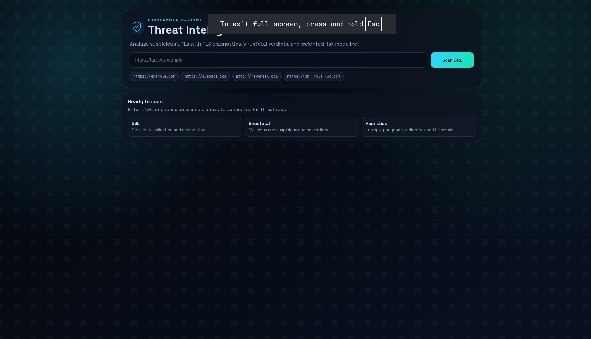
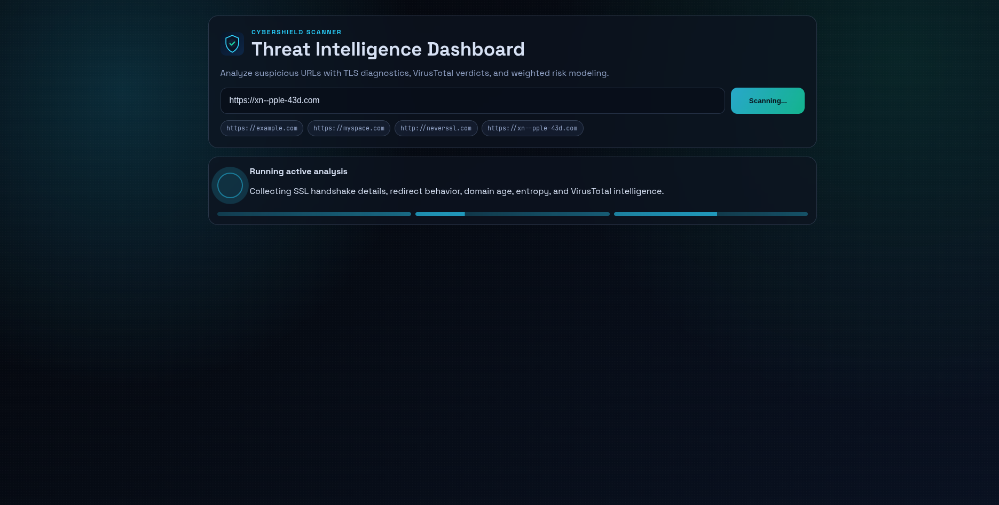
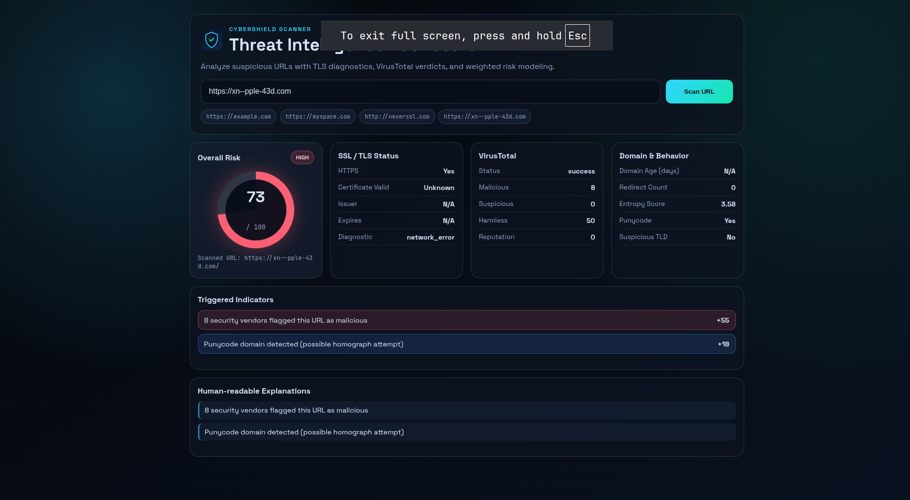

# CyberShield

> Lightweight cybersecurity URL scanner with SSL/TLS diagnostics, VirusTotal intelligence, and weighted risk scoring.

CyberShield is a portfolio-ready full-stack security tool designed for practical URL triage. It combines protocol validation, threat intel, and heuristic indicators into a clear `LOW` / `MEDIUM` / `HIGH` risk assessment.

## Features

- Accurate SSL/TLS diagnostics using Node.js TLS APIs (valid, expired, self-signed, hostname mismatch, handshake failure, timeout/network)
- VirusTotal API v3 integration (submit, poll analysis, fetch report fallback, rate-limit handling)
- Weighted risk model with score, severity level, triggered indicators, and human-readable reasons
- Heuristic checks for punycode domains, suspicious TLDs, entropy, IP-host URLs, excessive redirects, and young domains
- Modern cybersecurity dashboard with animated loading states, risk meter, and responsive card-based results
- Clean API-first architecture suitable for demos, recruiting portfolios, and open-source contributions

## Screenshots

Add screenshots in `docs/screenshots/` and reference them here.

- `docs/screenshots/dashboard-empty.png` - clean landing/empty state
- `docs/screenshots/dashboard-loading.png` - animated loading state
- `docs/screenshots/dashboard-result-low.png` - low-risk result example
- `docs/screenshots/dashboard-result-high.png` - high-risk result example

```md



```

## Architecture Overview

```text
React (Vite) frontend
    -> POST /api/scan
Node.js/Express backend
    -> URL normalization + heuristics
    -> SSL/TLS diagnostics (native tls/https/http)
    -> RDAP domain-age lookup
    -> VirusTotal API v3 (submit/poll/report)
    -> weighted risk scoring engine
    -> structured JSON report
```

Key backend modules:

- `backend/services/domainSslService.js` - redirects, TLS handshake, certificate classification
- `backend/services/virusTotalService.js` - VT v3 integration and fault handling
- `backend/services/riskScoringService.js` - weighted scoring + explanations
- `backend/services/scanService.js` - orchestration and final response shaping

## Tech Stack

- Frontend: React, Vite, Axios, custom CSS
- Backend: Node.js, Express, Axios, Helmet, CORS, Express Rate Limit
- External Intelligence: VirusTotal API v3, RDAP (`rdap.org`)

## Threat Detection Methodology

CyberShield combines three signal groups:

1. SSL/TLS authenticity
   - HTTPS presence
   - Certificate validity and identity matching
   - Explicit diagnostics for certificate and transport failures

2. Threat intelligence
   - VirusTotal malicious/suspicious/harmless counts
   - Reputation signal when available

3. Heuristic signals
   - Punycode and suspicious TLDs
   - High entropy domains and suspicious keywords
   - Domain age and redirect behavior

Each signal contributes a weight to the risk score (0-100), then mapped to:

- `LOW`
- `MEDIUM`
- `HIGH`

## Local Setup

### 1) Clone

```bash
git clone <your-repo-url>
cd cybershield
```

### 2) Backend

```bash
cd backend
npm install
cp .env.example .env
npm run dev
```

Backend default URL: `http://localhost:5000`

### 3) Frontend

```bash
cd frontend
npm install
cp .env.example .env
npm run dev
```

Frontend default URL: `http://localhost:3000`

## Environment Variables

### Backend (`backend/.env`)

```env
PORT=5000
VIRUSTOTAL_API_KEY=your_virustotal_api_key
FRONTEND_ORIGIN=http://localhost:3000
CORS_ORIGINS=
```

- `FRONTEND_ORIGIN`: single allowed origin (recommended for production)
- `CORS_ORIGINS`: optional comma-separated allowlist for multiple deployments

### Frontend (`frontend/.env`)

```env
VITE_API_BASE_URL=http://localhost:5000
```

- Leave empty for same-origin reverse-proxy setups.

## API Documentation

### `POST /api/scan`

Scan a URL and return risk diagnostics.

Request:

```json
{ "url": "https://example.com" }
```

Success response (trimmed):

```json
{
  "url": "https://example.com/",
  "timestamp": "2026-05-07T08:30:00.000Z",
  "threatIntel": {
    "virustotal": {
      "status": "success",
      "malicious": 0,
      "suspicious": 0,
      "harmless": 92,
      "undetected": 3,
      "reputation": 10
    }
  },
  "ssl": {
    "https": true,
    "valid": true,
    "issuer": "CLOUDFLARE, INC.",
    "expiresAt": "2026-07-01T21:24:46.000Z",
    "error": null
  },
  "risk": {
    "score": 0,
    "level": "LOW"
  },
  "indicators": [],
  "reasons": []
}
```

## Demo Scan Examples

Try these in local development:

- `https://example.com` (usually low-risk baseline)
- `https://myspace.com` (SSL validation sanity check)
- `http://neverssl.com` (non-HTTPS behavior)
- `https://xn--pple-43d.com` (punycode/homograph pattern)
- `http://185.199.108.153` (IP-host + non-HTTPS pattern)

## Deployment

### Frontend -> Vercel

Files included:

- `frontend/vercel.json`

Steps:

1. Import `frontend` folder as Vercel project
2. Build command: `npm run build`
3. Output directory: `dist`
4. Set env var: `VITE_API_BASE_URL=https://<your-render-backend-url>`

### Backend -> Render

Files included:

- `render.yaml`

Steps:

1. Create a new Render Blueprint from repo root
2. Render provisions `cybershield-api` from `backend/`
3. Set secret env vars:
   - `VIRUSTOTAL_API_KEY`
   - `FRONTEND_ORIGIN=https://<your-vercel-domain>`
   - optional `CORS_ORIGINS=https://<domain1>,https://<domain2>`
4. Verify health endpoint: `GET /health`

## Future Improvements

- Historical scan snapshots and trend view
- Optional queueing for slow third-party enrichment
- More granular vendor-level VirusTotal evidence display
- Unit/integration test coverage for scoring and SSL classifiers
- Dockerized local runtime for one-command startup

## License

MIT
